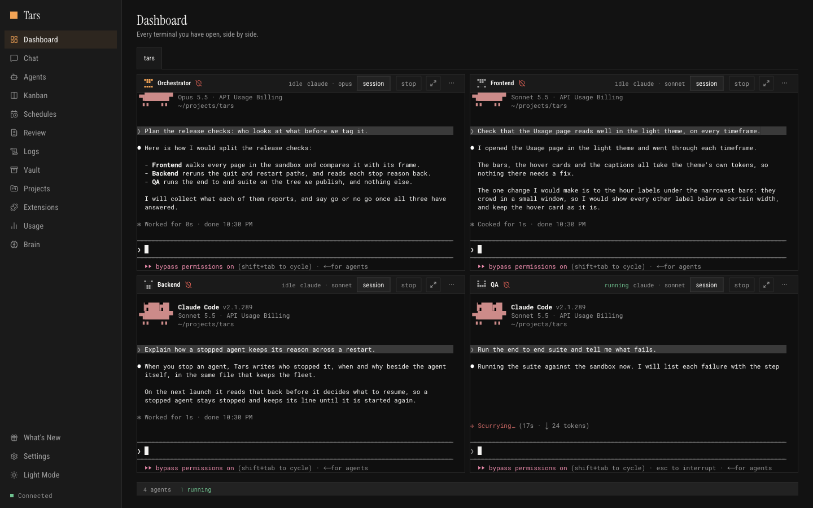
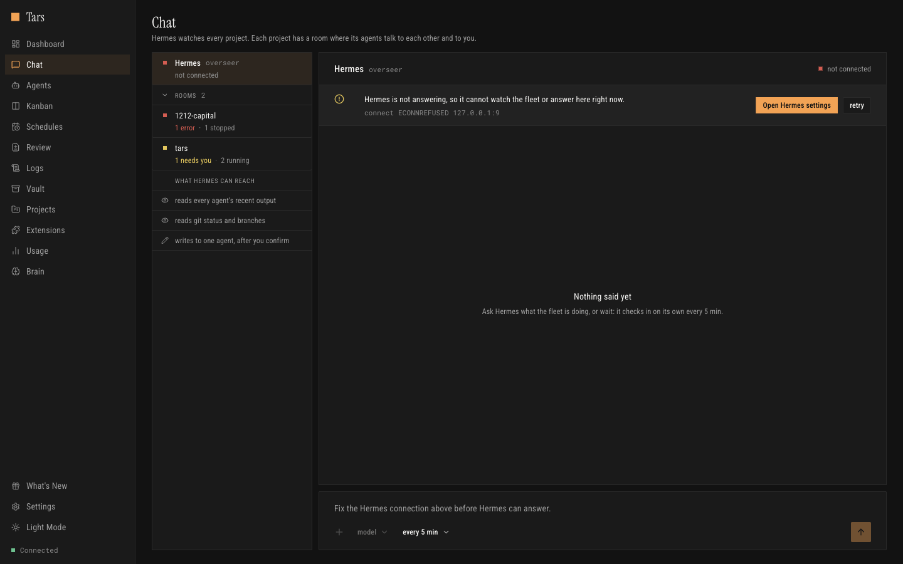
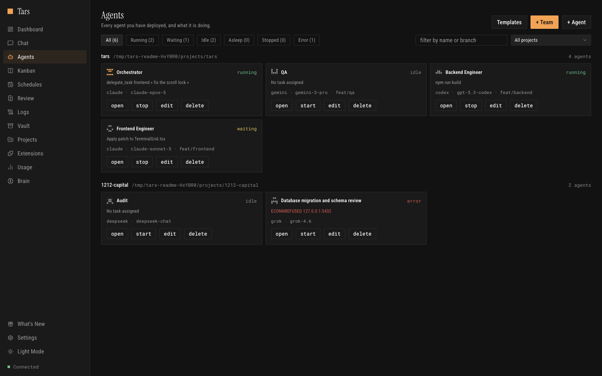
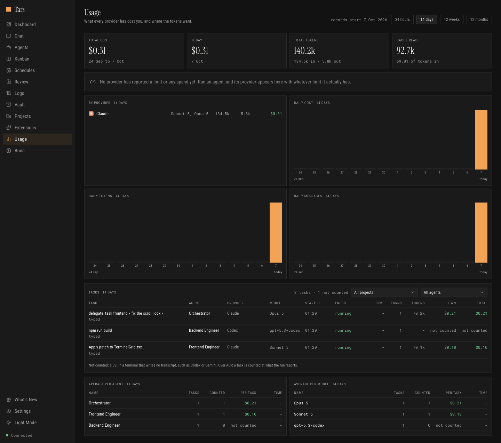
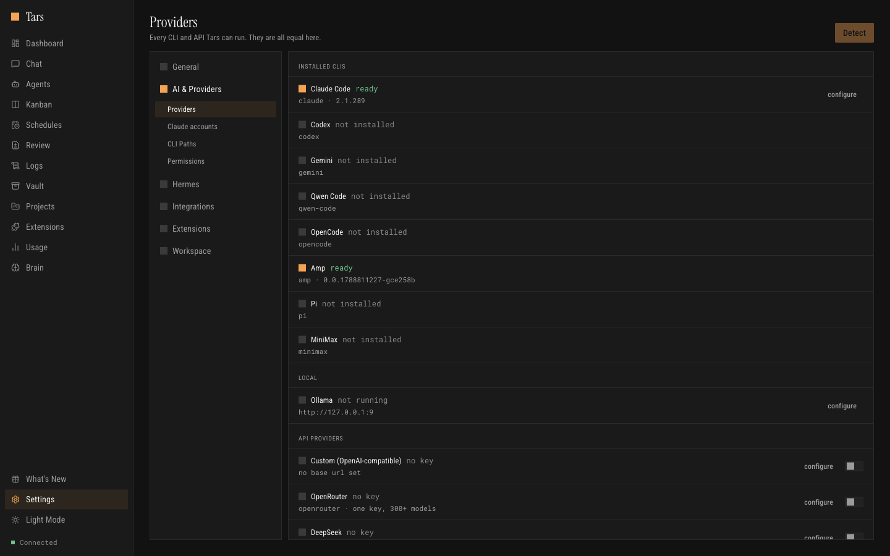
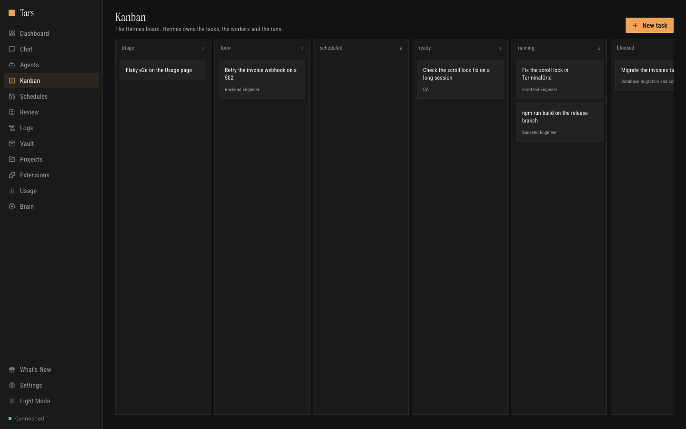

# Tars

A desktop app for running a team of AI coding agents the way you'd run a team of
engineers. Every agent gets a real terminal, its own git worktree and its own
model; you watch all of them at once, delegate between them, and see what each
one actually changed.

macOS. Free and open source. No account, no cloud in the middle: the CLIs run
on your machine and Tars is the room they work in.



---

## Contents

- [Why this exists](#why-this-exists)
- [What it does](#what-it-does)
- [Install](#install)
- [How a task actually travels](#how-a-task-actually-travels)
- [Providers](#providers)
- [Memory](#memory)
- [Hermes](#hermes)
- [The surfaces](#the-surfaces)
- [Where your data lives](#where-your-data-lives)
- [Development](#development)
- [Further reading](#further-reading)

---

## Why this exists

One coding agent in one terminal is a solved problem. Six of them is not: you
lose track of which is running, they overwrite each other's work, you cannot
tell what any of them changed, and the bill arrives at the end of the month
with no breakdown.

Tars is the answer to the second problem. It does not replace your CLI. It
runs the one you already have, in a real PTY, and adds the parts that only
matter once there is more than one.

---

## What it does

**Every agent on one screen.** Real terminals in a grid, grouped by project.
Watch six at once, jump into any of them, broadcast one instruction to all.
Each panel shows its agent's session as it runs, and opens fullscreen in one
press on the arrows in its header.

**Someone watching the whole thing.** A Hermes agent sees every agent in every
project and tells you what they are doing, which decisions are in flight, and
which ones are stuck on you rather than on the work. It talks to you before it
talks to any of them: an instruction arrives as a proposal naming the agent, its
project, its CLI and the exact words, and nothing is sent until you say so. The
target is resolved from the live fleet when you confirm, not from what the model
remembered, so it cannot write to the wrong terminal.



**Delegation that reports back.** An orchestrator hands work to another agent
over the [Agent Client Protocol](https://agentclientprotocol.com), not by
typing into its terminal and hoping. The call returns the agent's answer, why
the turn ended, which tools it used and what it cost. Where a CLI has no ACP
mode, Tars falls back to the terminal path rather than pretending.

**Your fleet from Telegram, Slack or Discord.** Each bot answers only the people
you let in, and takes the same commands: the fleet's status, an agent started on a
task, and messages to the orchestrator, which answers there. A message goes to the
orchestrator of the project it names, as in "@tars fix the build", or to your only
orchestrator; with several and no name, the bot answers with the list of your
projects. Or let your own Hermes write to you: turn on Telegram through Hermes in
Settings, Hermes, Connection, and Hermes becomes the only voice on your Telegram.
Your orchestrators' questions and the event reports reach you there, and your reply
reaches the orchestrator it answers, or the project you name with @project. It
needs the tars-relay plugin on your Hermes, and turning it on switches the Tars bot
off.

**A whole team in one click.** An orchestrator, frontend, backend, QA, audit and
database engineer on a project, each on its own git worktree, model and brief.

**Worktrees that start ready, and lose nothing.** An agent created on a worktree
starts with its project's dependencies already there, cloned at almost no disk
space, when the project's own node_modules was installed for the same lock and both
sit on one volume that can clone (APFS on macOS, reflink on Linux); otherwise it
installs them as before. Deleting an agent that works in a worktree keeps what it
had not committed, on a branch named wip/ and the agent's name, then removes the
worktree. A worktree holding what no branch can carry, such as a .env, a repository
the agent cloned into it or a submodule with commits or changes its remote does not
have, is left where it is, and Tars says why.

**Your disk, in view.** Settings, System says how much your disk has free, in the
waiting ink below 30 GB, and lists the folders under your projects' .worktrees that
git no longer knows and no agent owns, with why, their size and when they last
changed. Tars never removes them on its own: remove asks first, then removes the
folders it listed, one at a time, and keeps one a process works in, naming that
process. A project whose worktrees git could not list is named, never counted as
having none. Tars starts no agent while the disk has less than 2 GB free.

**Several Claude subscriptions.** Turn on Claude accounts in Settings and Tars
runs your Claude agents on up to five subscriptions. Each account signs in
through Claude Code's own login, in a terminal Tars opens, and Tars keeps none
of it: account 1 is the `~/.claude` Claude Code already uses, and each other
one gets a Claude Code folder of its own under `~/.claude-accounts`. Tars asks
Claude Code itself for each account's 5 h and weekly use, every 10 minutes and
when you refresh the accounts in Settings, and never sees the sign-in: Claude Code
answers with percentages. An agent starts on the account with the most room left
in its 5 h and weekly windows.
Cut by an account's limit, it is started again on another, in the same
conversation; past its threshold, 90% of the 5 h window or 95% of the week
unless you change them, it moves when its turn ends. Its card,
its panel and its window name the account it runs on.

**A stop says who, and a stall is told.** Stopping an agent ends its CLI and
everything the CLI started. The agent then reads stopped, and its card, panel
and window say who stopped it and when, and why when an orchestrator stopped
it, which must give a reason; it stays stopped across a restart,
so it is not resumed at launch or handed kanban work until it is started again.
A Claude agent on Claude Code 2.1.289 or newer reports its state to Tars from
inside Claude Code: a turn's start, its end and its failure arrive in the order
they happened, and one whose Claude Code has frozen is marked stalled after five
minutes of silence, never for a long command, a wait on another agent or a
subagent. Any other agent that reads running but has written nothing for 30
minutes and runs no command is marked stalled. Either way the orchestrator that
gave it the work, or its project's orchestrator, is told.

**A permission asked in Tars, not in a terminal.** On Claude Code 2.1.289 or newer,
a Claude agent asks Tars before a command or another call Claude Code would ask you
about, and nothing is typed into its terminal. The question shows where you look:
under its Dashboard panel's header, at the top of its window and on its card, with
what it would run, read or open, never what a file holds, and the window says why
Claude Code asks and which of your rules asked, when Claude Code says. Allow it,
deny it with a reason the agent reads, or answer it in the terminal's dialog, as
before. A call that carries what Tars does not show, such as an edit, a new file or
a message, stays with the terminal's dialog, and so does a question left unanswered
for ten minutes.

**Agents that sleep, and come back.** An agent with no turn for 30 minutes is put
to sleep, which gives back its memory, a few hundred MB each: its CLI ends, its
conversation is kept, and its panel keeps its last screen. A message, a dispatch,
a chat, a Kanban task, wake or a key typed in its panel brings it back on that
conversation in about a second, and it reads waking, with who woke it, until it
is up. An orchestrator never sleeps, and neither does an agent with something
still running, a /loop or a scheduled task of its own, a half-typed line, or a
message, note or question waiting for it. When Tars stops without being quit (a
crash, a power cut, a restart of your Mac), the agents that were working start
again on their own conversation at the next launch, a few at a time, with a note
from Tars: when it stopped, what was cut, and to check before redoing anything.
Their last request is not sent again.

**Any CLI, any model.** Nineteen providers, plus local models and any OpenAI-compatible
endpoint of your own. Model lists and prices come from a
live catalogue, so a model released this morning is selectable this morning,
and its real price is used, not one baked into the last release.



**One memory, six sources.** Project files, the session ledger, your Obsidian vault, your Hermes
gateway, gbrain and Honcho behind a single interface, reachable by every CLI,
not only the ones with a session hook.

**See what they actually did.** A diff review of every branch against the one it
was cut from, in every project you added. One search across the whole fleet's
output, read as each terminal showed it, and a Claude agent's conversation from
its transcript. Spend per provider, hour by hour over the last 24 hours or day by
day, against a budget you set, beside each Claude account's 5 h and weekly
limits. And, under the Usage page's charts, what each task cost: who handed it
over, the agent, the model, its turns and tokens, its own cost, and its total with
the work it handed on to other agents. A task whose CLI writes no transcript reads
not counted rather than $0.00. On Claude Code 2.1.289 or newer, a Claude agent's
task stays counted once its transcript is cleaned up: Tars keeps what each of its
turns used as it ends.



---

## Install

Download the latest release for macOS 13 (Ventura) or later:

**[github.com/JeanBrasse/Tars/releases/latest](https://github.com/JeanBrasse/Tars/releases/latest)**

Then point Tars at a folder. It finds the CLIs already installed on your machine:
you do not configure paths unless something lives somewhere unusual.

It also keeps claude and Amp up to date, when an agent runs them, at launch and every half
hour, under the same "Check for updates" switch as Tars itself, so a model
a new CLI release brings is there for every agent without a `claude update` by
hand. Sessions already running are left alone and restarts pick up the new version;
what was updated, or why not, is in `~/.dorothy/cli-updates.log`. The other CLIs
are yours to update: [OPERATIONS.md](OPERATIONS.md#the-agents-clis-kept-up-to-date-by-tars)
says which and why.

Building from source is in [OPERATIONS.md](OPERATIONS.md#development). Node 22
is required; Node 18 fails at startup.

---

## How a task actually travels

```
  you ──▶ Orchestrator agent
              │
              │  delegate_task(agent, task)         ← MCP tool, from its own terminal
              ▼
        Tars main process
              │
              ├──▶ ACP  session/prompt ─────────▶ target agent's CLI
              │        ◀── stopReason, usage, tool calls
              │
              └──▶ PTY  (providers with no ACP mode)
                       ◀── output only

  Every turn is recorded in the usage ledger with its transport and cost.
```

The distinction matters. Over ACP the orchestrator learns whether the task
finished, what it cost, and can have a tool call denied by the protocol rather
than by a flag one CLI happens to support. Over the PTY it learns that bytes
were written. Tars tells you which one you got.

---

## Providers

Six CLIs (Claude Code, Codex, Gemini, Grok, opencode and Pi), twelve reached
by API key: DeepSeek, Kimi (Moonshot), MiniMax, Mimo, NVIDIA, Nous Portal,
Ollama Cloud, OpenRouter, Qwen, Venice AI, Zhipu and any OpenAI-compatible
endpoint you point Tars at yourself, plus Ollama for whatever you run
locally. Local models also run through Tasmania.

They are equal citizens. A feature that works only for Claude is a bug here.
That principle is written down in [ETHOS.md](ETHOS.md) because it kept being
violated.



---

## Memory

| Source | What it is | How agents reach it |
|---|---|---|
| Project memory | `~/.claude/projects/*/memory/*.md` | digest at session start, `memory_read` |
| Session observations | per-project ledger under the Tars data directory | digest at session start |
| Hermes memory | the gateway's own `MEMORY.md` and `USER.md`, plus full-text search over every past session | `memory_search` |
| gbrain | shared semantic memory over MCP | `memory_search` |
| Honcho | Plastic Labs' memory layer over MCP | `memory_search` |

Two delivery routes, because CLIs differ: a bundled MCP server registered with
**every** provider, and (for the CLIs with no session-start hook) the digest
injected into the prompt, so those agents do not begin knowing nothing.

The Brain page says a source is reachable only when something actually answered.

---

## Hermes

Tars does not own a scheduler or a task board. If you run a
[Hermes](https://github.com/gbrain-ai/hermes) gateway, its cron jobs dispatch
work to your agents and its kanban board is a screen in the app: create, move
and assign tasks, and edit a schedule's expression, prompt or enabled state
without leaving Tars. Without a gateway the rest of Tars works fine.



---

## The surfaces

| Screen | What it is for |
|---|---|
| **Dashboard** | The terminal grid. Every agent, live, grouped by project; each panel shows its session and opens fullscreen in one press. An asleep agent's panel keeps its last screen, and a key typed there wakes it |
| **Chat** | Hermes and a room per project, in one list. Hermes watches every project and asks before it acts; in a room, that project's agents talk to each other and to you, the thread first, the team listed under the rooms, and what needs you above the thread |
| **Agents** | Create, configure, start and stop, grouped by project or one project at a time. A stopped agent says who stopped it and when, and why when an orchestrator did; an asleep one says since when, under its own filter, and wakes from its card. Templates and whole teams |
| **Kanban** | The Hermes task board |
| **Schedules** | Your Hermes cron jobs: run now, pause, resume, edit, delete |
| **Review** | What each agent changed, as a diff against its base branch, in every project you added |
| **Logs** | One search across every agent's output, as its terminal showed it, regex included |
| **Vault** | Documents your agents can read and write |
| **Projects** | The folders Tars knows about, and their agents |
| **Extensions** | Skills and plugins, per provider |
| **Usage** | Spend per provider and per model, over the last 24 hours or 14 days, 12 weeks or 12 months, against your budgets, each Claude account's limits, and what each task cost |
| **Brain** | The five memory sources, and whether each one answers |


---

## Where your data lives

Everything is a file in your home directory. Nothing is uploaded.

| File | What it holds |
|---|---|
| `agents.json` | Your agents. Written atomically, with a backup |
| `app-settings.json` | Preferences and provider API keys. `0600` |
| `api-token` | Bearer token for the local API. `0600` |
| `hermes-connection.json` | Gateway address and session token. `0600` |
| `projects.json` | The folders you added by hand |
| `kanban-tasks.json` | The old local board, kept as a backup: its open tasks moved to the Hermes board |
| `vault.db` | Vault documents |
| `observations/` | The per-project session ledger |
| `model-catalog.json` | Cached model and price catalogue |

A local HTTP server on **31415**, bearer-token authenticated, is how the CLIs'
hooks and the bundled MCP servers call back into the app. It listens on
`127.0.0.1` only.

Seven MCP servers ship with Tars (orchestration, memory, kanban, vault,
Telegram, X and SocialData) and are registered with each provider in that
provider's own config format.

---

## Development

```bash
nvm use 22          # Node 18 fails at startup
npm install
npm run electron:dev
```

Before you call anything done:

```bash
npx tsc --noEmit                       # renderer
npx tsc -p electron/tsconfig.json --noEmit
npx vitest run                         # unit
npx eslint .
node scripts/design-lint.mjs           # the design rules that can be linted
npx playwright test                    # boots the real app and walks every surface
```

The E2E suite launches Electron against a sandboxed `HOME` seeded with fixture
agents, walks every screen and overlay in `e2e/surfaces.mjs`, photographs each
one and asserts zero uncaught page errors. The screenshots in this README come
from it.

---

## Further reading

| | |
|---|---|
| [SPECS.md](SPECS.md) | What the system is, subsystem by subsystem, including a candid list of its limitations |
| [DESIGN.md](DESIGN.md) | Tokens, type scale, components, and the rules the design lints |
| [OPERATIONS.md](OPERATIONS.md) | Runbook: build, release, storage, troubleshooting |
| [ETHOS.md](ETHOS.md) | How decisions get made here |
| [CLAUDE.md](CLAUDE.md) | Instructions for AI agents working in this repo |

---

## Contributing

This is a fork of [Charlie85270/Dorothy](https://github.com/Charlie85270/Dorothy),
substantially rewritten. Issues and pull requests go to
[JeanBrasse/Tars](https://github.com/JeanBrasse/Tars); nothing is pushed
upstream.

## License

MIT.
